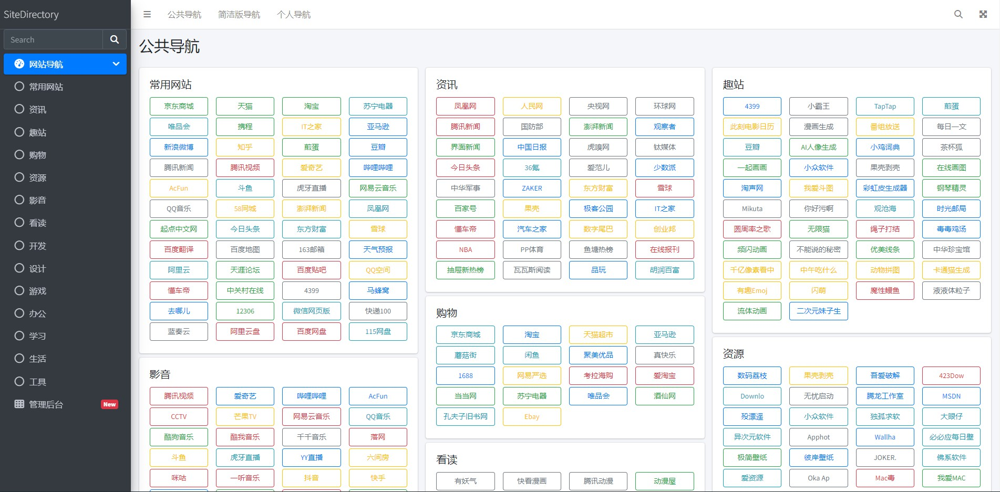
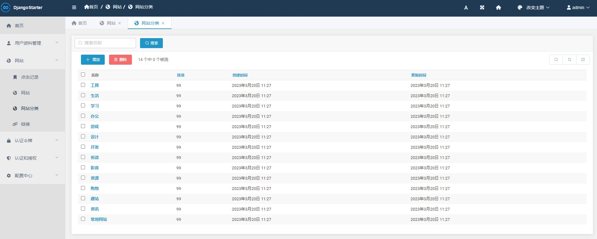
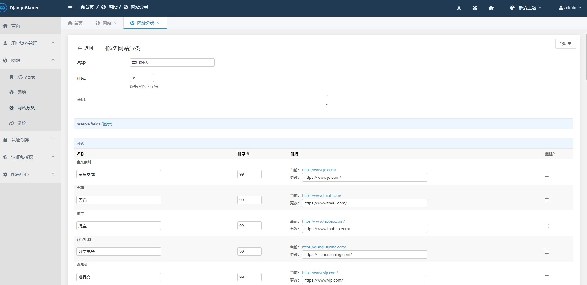

# SiteDirectory 网站导航

🌏 基于 DjangoStarter 开发的网站导航

Demo: [index.sblt.deali.cn:9000](https://index.sblt.deali.cn:9000/)


## Features

- 美观的导航界面（两种风格）
- 完善的后台管理功能
- 网站分类管理
- 网站支持多个链接
- 支持统计每个网站的点击量
- 跟踪每个网站的点击记录，便于后续分析展示


## 技术

- 后端基于: [DjangoStarter](https://github.com/Deali-Axy/DjangoStarter)
- 前端模板: Bootstrap/AdminLTE


## Screenshots

### 主页


简洁版主页



### 管理后台

网站分类



编辑网站列表




## 部署

使用 `docker-compose` 部署

```bash
git clone https://github.com/Deali-Axy/SiteDirectory.git
cd SiteDirectory
docker-compose up -d
```

静态资源初始化

目前只能在本地使用 npm/yarn 来安装前端依赖，然后使用 gulp 打包后上传到服务器。

在 docker 中自动构建正在开发中，很快就上线。

```bash
# 安装依赖
yarn
# 打包
gulp move
```

然后把 `static/lib` 目录上传到服务器相同位置即可

## LICENSE

```
Apache License Version 2.0, January 2004
http://www.apache.org/licenses/
```
