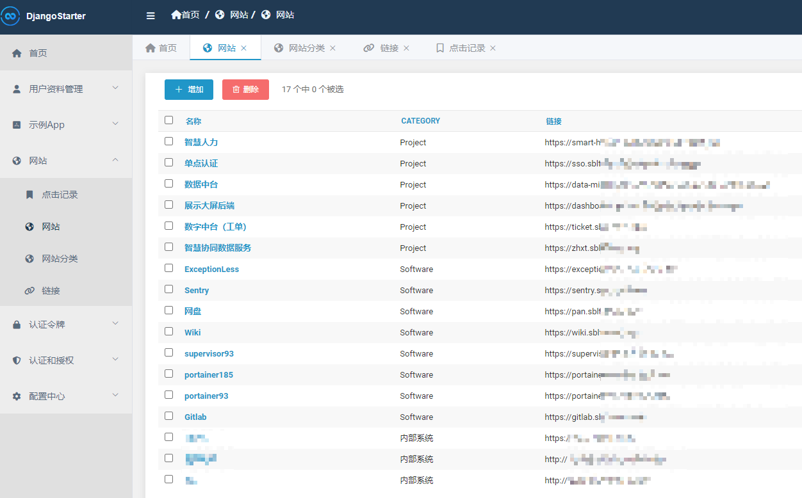

# SiteDirectory 网站导航

🌏 基于 DjangoStarter 开发的网站导航


## Features

- 美观的导航界面
- 完善的后台管理功能
- 网站分类管理
- 网站支持多个链接
- 支持统计每个网站的点击量
- 跟踪每个网站的点击记录，便于后续分析展示


## 技术

- 后端基于: [DjangoStarter](https://github.com/Deali-Axy/DjangoStarter)
- 前端模板: Bootstrap/AdminLTE


## Screenshots

主页


管理后台




## LICENSE

```
Apache License Version 2.0, January 2004
http://www.apache.org/licenses/
```
